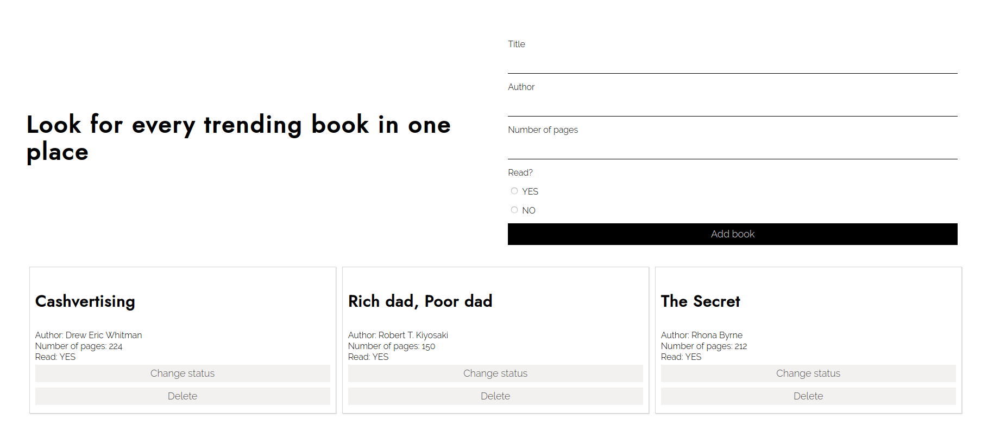

# Library JS App

> We developed an Javascript application in which we had the chance to play around with functions constructors and objects prototyping. In this application you can add as many books you want to the library as well as deleting and updating them.

## Built With

- JS
- HTML
- CSS

## Live Demo

[Live Demo Version](https://raw.githack.com/bren2102/library/feature/index.html)

## Authors

👤 **Diego Antonio Reyes Coronado**

- Github: [@xtrmdarc](https://github.com/xtrmdarc)
- Twitter: [@diegoreyesco](https://twitter.com/DiegoAn91629127)
- Linkedin: [diegoreyesco](https://www.linkedin.com/in/diego-reyes-coronado)

👤 **Brenda Yucra**

- Github: [@bren2102](https://github.com/bren2102) 
- Twitter: [@BrendaYucra2](https://twitter.com/BrendaYucra)
- Linkedin: [Brenda Yucra](https://www.linkedin.com/in/brenda-yucra-51980681/)

## 🤝 Contributing

Contributions, issues and feature requests are welcome!

Feel free to check the [issues page](issues/).

## Show your support

Give a ⭐️ if you like this project!
